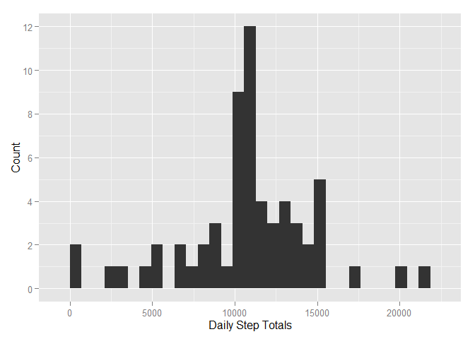
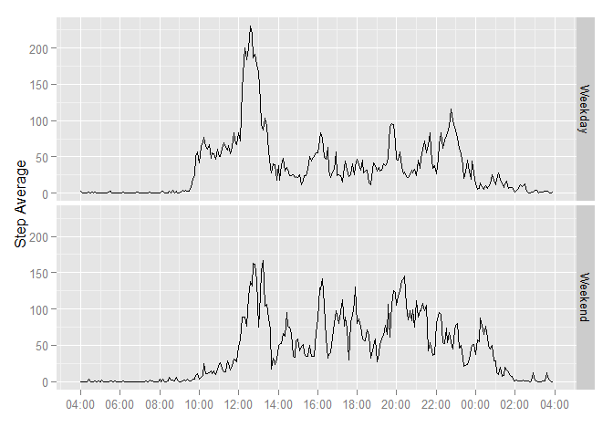

# Reproducible Research: Peer Assessment 1

```r
require(knitr)
```

```
## Warning: package 'knitr' was built under R version 3.2.1
```

```r
require(dplyr)
require(ggplot2)
```

```
## Warning: package 'ggplot2' was built under R version 3.2.1
```

```r
opts_chunk$set(echo=TRUE)
```

## Loading and preprocessing the data
First, the data needs to be read into R using the read.csv function (as a note, you'll already need to be in the directory where the activity.csv file is stored):

```r
data<-read.csv(unz("activity.zip", "activity.csv"),colClasses=c("numeric","character","numeric"))
```

Then, the date variable needs to be converted from a character vector to a Date vector.

```r
data$date<-as.Date(data$date, "%Y-%m-%d")
```

## What is mean total number of steps taken per day?
To answer this question, the data needs to first be grouped on the date variable and then the average taken of the number of steps on each day.

```r
steps<-data%>%na.omit()%>%group_by(date)%>%summarise(total_steps=sum(steps))
```
Then a histogram needs to be built, in this case with the ggplot2 system.

```r
steps.plot<-ggplot(steps,aes(total_steps))+geom_histogram()+
    labs(main="Total Steps per Day")+scale_y_continuous(breaks=seq(0,10,2))+
    xlab("Daily Step Totals")+ylab("Count")
print(steps.plot)
```

 

Finally, we'll use the data set we created above to check the overall mean and median for the number of steps taken.

```r
head(summarize(steps,mean=mean(total_steps),median=median(total_steps)))
```

```
## Source: local data frame [1 x 2]
## 
##       mean median
## 1 10766.19  10765
```

## What is the average daily activity pattern?
As with the previous question, the first step here is to make a new data set, though in this case it is grouped by the 'interval' variable before the mean of the number of steps is taken.

```r
activity<-data%>%group_by(interval)%>%
    summarize(average_steps=mean(steps,na.rm=TRUE))
```

Then, we build the plot of the time series we've just created, again using ggplot2.

```r
activ.plot<-ggplot(activity,aes(interval,average_steps))+geom_line()+
    labs(main="Average Steps per Time Interval")+xlab("Interval")+
    ylab("Step Average")
```

Finally, we pull up the 5-minute interval with the highest average of steps:

```r
filter(activity,average_steps==max(average_steps))
```

```
## Source: local data frame [1 x 2]
## 
##   interval average_steps
## 1      835      206.1698
```


## Imputing missing values
The first thing to do here is just look at a count of all of cases with missing data.

```r
ok<-complete.cases(data)
sum(!ok)
```

```
## [1] 2304
```

Then, as always, we create a new data set, where we replace the instances of missing steps with the average for that 5-minute inverval and then group the data by date and look at the sum on each day.

```r
missing<-mutate(data, steps = replace(data$steps, is.na(data$steps), 
                                         activity$average_steps))
miss<-missing%>%group_by(date)%>%summarise(total_steps=sum(steps))
```
Then we'll build a histogram of the new data.

```r
miss.plot<-ggplot(miss,aes(total_steps))+geom_histogram()+
    labs(main="Total Steps per Day with Missings Replaced")+scale_y_continuous(breaks=seq(0,10,2))+
    xlab("Daily Step Totals")+ylab("Count")
print(miss.plot)
```

 

Finally, we'll compare the mean and median of the data with imputed values to the original without them.

```r
head(summarize(miss,mean=mean(total_steps),median=median(total_steps)))
```

```
## Source: local data frame [1 x 2]
## 
##       mean   median
## 1 10766.19 10766.19
```

```r
head(summarize(steps,mean=mean(total_steps),median=median(total_steps)))
```

```
## Source: local data frame [1 x 2]
## 
##       mean median
## 1 10766.19  10765
```


## Are there differences in activity patterns between weekdays and weekends?
The simplest way to do this is to use the `weekday()` command on the 'date' variable and create a factor variable based on whether the day is a weekend day or not. Then the data needs to be grouped on the the 'weekday' and 'interval' variables so that the mean number of steps can be taken.

```r
weekend<-c("Saturday","Sunday")
data$weekday<-factor((weekdays(data$date) %in% weekend),levels=c("FALSE","TRUE"),
                     labels=c("Weekday","Weekend"))
day<-data%>%group_by(weekday,interval)%>%
    summarize(average_steps=mean(steps,na.rm=TRUE))
```

Finally, we build a pair of time interval plots that have been faceted on the 'weekday' variable.

```r
day.plot<-ggplot(day,aes(interval,average_steps))+geom_line()+
    labs(main="Average Steps per Time Interval")+xlab("Interval")+
    ylab("Step Average")+facet_grid(weekday~.)
print(day.plot)
```

 
